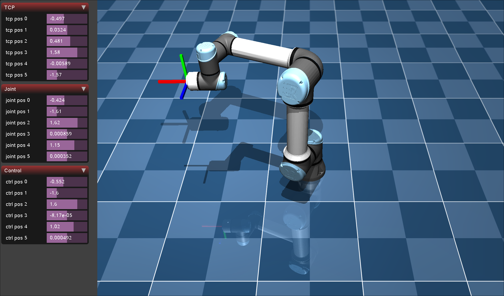

## mojuco_ur5

This project involves the verification of various algorithms for the UR5 using the Mujoco simulation.

## Implemented functions
- DH description
- forward kinematics
- inverse kinematics (Geometric solution)
- linear motion
